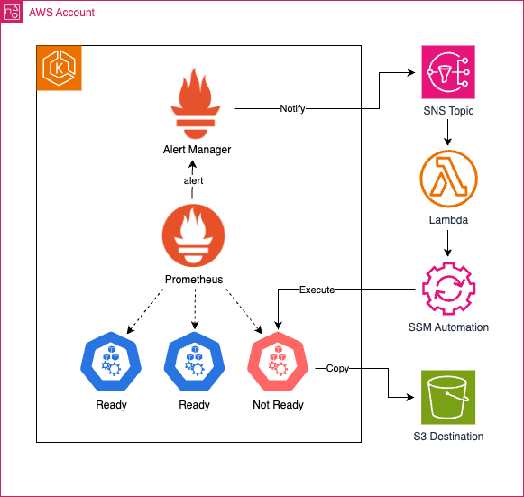

# EKS Node Log Collector Automation using SSM and Alert Manager

EKS Node Log Collector Automation receives alerts from EKS cluster(s) and executes the AWSSupport-CollectEKSInstanceLogs SAW Workflow.

## Background
[AWS Support Automation Workflow (SAW)](https://aws.amazon.com/premiumsupport/technology/saw/) is a collection of AWS Systems Manager self-service automation runbooks, provided by AWS Support to help troubleshoot, diagnose, and remediate common issues with AWS resources.

For troubleshooting EKS node related issues, the SAW runbook i.e. `AWSSupport-CollectEKSInstanceLogs` can be leveraged to collect the necessary logs from targeted EKS nodes, and upload the log bundle to a desired S3 bucket. Although it automatically collects the logs from the target nodes, manual intervention is required in identifying the defective node(s), and triggering the automation either by using the AWS console or AWS CLI.

To eliminate the manual efforts required by the EKS users, we propose the following solution to automatically detect problems with EKS nodes, and trigger the above SAW automation to perform the necessary log collection.

## Solution
[Prometheus Alert Manager](https://prometheus.io/docs/alerting/latest/alertmanager/) is a component of the Prometheus monitoring system that is responsible for handling alerts generated by Prometheus. It takes care of deduplicating, grouping, and routing alerts to the desired receiver integrations such as Email, Slack, PagerDuty, SNS or many other [destinations](https://prometheus.io/docs/operating/integrations/#alertmanager-webhook-receiver) through a webhook mechanism.

In this solution, we will leverage Prometheus to capture the node problems, and leverage Alert Manager to send the node alerts to an SNS topic in the cluster account. An AWS Lambda function is configured to receive alerts sent by Alert Manager to the SNS topic. After receiving the alert(s), the Lambda function will query the EC2 API to retrieve the Instance ID(s) of the problematic node(s) and invokes the AWSSupport-CollectEKSInstanceLogs SAW document, which will use SSM to log into the Instance(s) to perform log collection. Once the logs are collected, they are sent to a common S3 bucket for storage.

Prometheus is configured to send alert(s) when a node is in `Not Ready` state. Alert Manager is configured to send an alert notification to SNS for every node that is in Not Ready state. After the notification is sent, Lambda will collect node names from the alert labels, and triggers an SSM StartAutomationExecution API call to start the SAW automation execution. 

However, when there are more than "threshold" (configurable) number of nodes in `Not Ready` state, it is not required to collect logs from all the nodes. To avoid collecting logs for all the nodes in situations where large number of nodes are in Not Ready state, a circuit breaker is implemented using Alert Manager inhibitor rules. Prometheus is configured to send an alert when more than "threshold" number of nodes are in `Not Ready` state. Alert Manager is configured to stop sending alert notifications for individual nodes and send a single notification to Lambda instead. Upon receipt of this alert notification, Lambda will query the EKS API server to retrieve a list of all nodes in `Not Ready` state, and query the S3 bucket to see if there are already logs for "threshold" number of nodes from the retrieve node list. If not, it performs log collection workflow for "threshold" number of nodes.


## Architecture


## Setup Instructions

#### 1. Create an EKS Cluster
```
export CLUSTER_NAME=<cluster-name>
export CLUSTER_REGION=<region>
export AWS_ACCOUNT_ID=<aws-account-id>
eksctl create cluster --name ${CLUSTER_NAME} --region ${CLUSTER_REGION}
```

#### 2. Deploy AWS SAM template to create the S3 Bucket, Lambda function, SNS Topic, and related components
```
sam build --use-container
sam deploy --stack-name elca-${CLUSTER_NAME}-${CLUSTER_REGION} \
           --s3-prefix elca-${CLUSTER_NAME}-${CLUSTER_REGION} \
           --region ${CLUSTER_REGION} \
           --parameter-overrides ParameterKey=ClusterID,ParameterValue=${CLUSTER_NAME} \
                                 ParameterKey=ClusterRegion,ParameterValue=${CLUSTER_REGION} \
                                 ParameterKey=LogRetentionDays,ParameterValue=7
```
```
# Set the SNS Topic created in the above step as an environment variable
export SNS_TOPIC_ARN=<topic-arn-from-sam-deploy-output>
export LOG_COLLECTION_BUCKET=<LogCollectionS3Bucket-arn-from-sam-deploy-output>
export LAMBDA_EXECUTION_ROLE_ARN=<iam-role-arn-of-SSMTriggerFunctionIAMRole-from-sam-deploy-output>
```

#### 3. Create an IAM Policy and attach it to EKS nodegroup IAM Role(s) for log bundle upload permissions
```
cat <<EOF > /tmp/s3-log-upload-policy.json
{
    "Version": "2012-10-17",
    "Statement": [
        {
            "Effect": "Allow",
            "Action": [
                "s3:GetBucketAcl",
                "s3:GetBucketPolicyStatus"
            ],
            "Resource": "$LOG_COLLECTION_BUCKET"
        },
        {
            "Effect": "Allow",
            "Action": [
                "s3:PutObject"
            ],
            "Resource": "$LOG_COLLECTION_BUCKET/eks_i-*"
        }
    ]
}
EOF

aws iam create-policy --policy-name SSMAutomationEKSLogCollector-${CLUSTER_NAME}-${CLUSTER_REGION} --policy-document file:///tmp/s3-log-upload-policy.json

NODEGROUP_ROLE_NAME=$(eksctl get nodegroups --cluster $CLUSTER_NAME --region $CLUSTER_REGION -o json | jq -r '.[0].NodeInstanceRoleARN' | cut -d'/' -f2)

aws iam attach-role-policy --role-name $NODEGROUP_ROLE_NAME --policy-arn arn:aws:iam::$AWS_ACCOUNT_ID:policy/SSMAutomationEKSLogCollector-${CLUSTER_NAME}-${CLUSTER_REGION}
```

#### 4. Create an IRSA role for the alertmanager pod to perform AWS actions
```
cat <<EOF > /tmp/alertmanager-sns-policy.json
{
    "Version": "2012-10-17",
    "Statement": [
        {
            "Sid": "VisualEditor0",
            "Effect": "Allow",
            "Action": [
                "sns:Publish"
            ],
            "Resource":"*"
        }
    ]
}
EOF

aws iam create-policy --policy-name AlertManagerSNSPolicy-${CLUSTER_NAME}-${CLUSTER_REGION}  --policy-document file:///tmp/alertmanager-sns-policy.json --region ${CLUSTER_REGION}
```

```
eksctl utils associate-iam-oidc-provider --region=${CLUSTER_REGION} --cluster=${CLUSTER_NAME} --approve
```

```
eksctl create iamserviceaccount \
    --cluster=${CLUSTER_NAME} \
    --namespace=prometheus \
    --name=alertmanager \
    --role-name AlertManagerSNSRole-${CLUSTER_NAME}-${CLUSTER_REGION} \
    --attach-policy-arn=arn:aws:iam::${AWS_ACCOUNT_ID}:policy/AlertManagerSNSPolicy-${CLUSTER_NAME}-${CLUSTER_REGION} \
    --region=${CLUSTER_REGION} \
    --approve
```

#### 5. Deploy the kube-prometheus-stack helm chart
```
helm repo add prometheus-community https://prometheus-community.github.io/helm-charts
helm repo update
sed "s/TOPIC_ARN/$SNS_TOPIC_ARN/g; s/REGION/$CLUSTER_REGION/g" prometheus/kube-prometheus-stack-values.yaml.tmp > prometheus/kube-prometheus-stack-values.yaml
helm upgrade --install prometheus prometheus-community/kube-prometheus-stack -n prometheus --values ./prometheus/kube-prometheus-stack-values.yaml
```

#### 6. Provide EKS read-only access to the Lambda IAM Role

```
kubectl create clusterrole elca-nodeviewer --verb=get,list,watch --resource=nodes
kubectl create clusterrolebinding elca-nodeviewer --clusterrole=elca-nodeviewer --group=elca-nodeviewer

aws eks create-access-entry --cluster-name ${CLUSTER_NAME} \
    --principal-arn ${LAMBDA_EXECUTION_ROLE_ARN} \
    --kubernetes-groups elca-nodeviewer \
    --region ${CLUSTER_REGION}
```

#### 7. Test the workflow

Using SSM, log into few EKS nodes using the below command:
```
aws ssm start-session --target <instance-id>
```
Run the below command using sudo:
```
sudo systemctl stop kubelet
exit
```
This will stop kubelet on the nodes, and corresponding alerts are sent from the EKS cluster to the Lambda, which in turn executes the `AWSSupport-CollectEKSInstanceLogs` Support Automation Workflow (SAW).