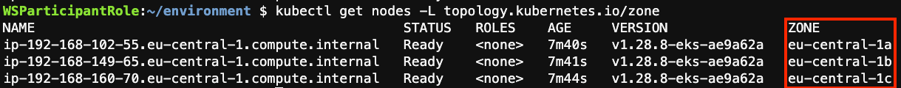
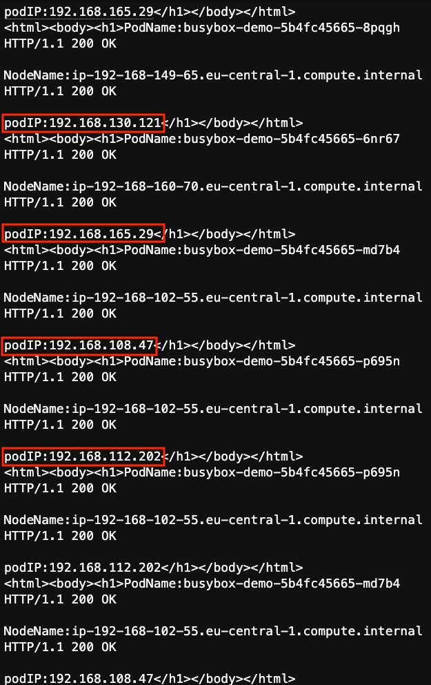

# EKS Topology Aware Routing (TAR)🚀

## What is Topology Aware Routing 
 
Topology Aware Routing (TAR) plays a crucial role in enhancing container resiliency within Kubernetes clusters, especially in multi-zone environments. By intelligently distributing Pods across different failure domains (nodes, zones, or regions), TAR minimizes the risk of an entire application being impacted by a single point of failure. This failure domain isolation ensures that if a failure occurs in one domain, replicated Pods in other domains can quickly take over, minimizing downtime and ensuring application availability.
 
Additionally, TAR promotes efficient resource utilization by evenly distributing Pods across available resources, preventing resource contention and improving overall cluster stability. By adjusting routing behavior to prefer keeping traffic within the zone it originated from, TAR can potentially reduce costs and improve network performance, further contributing to the overall resiliency and efficiency of the Kubernetes cluster.
 
In summary, Topology-aware Routing is a valuable feature in Kubernetes that enhances container resiliency by providing failure domain isolation, efficient resource utilization, faster recovery from failures, and potential cost and performance benefits through optimized traffic routing within zones.
 
* [Topology Aware Routing](https://kubernetes.io/docs/concepts/services-networking/topology-aware-routing/)
* [Topology Aware Routing on Amazon EKS](https://aws.amazon.com/blogs/containers/exploring-the-effect-of-topology-aware-hints-on-network-traffic-in-amazon-elastic-kubernetes-service/)
 
## Topology Aware Routing Caveats
 
Topology Aware Routing (TAR) offers an excellent approach for reducing traffic costs and enhancing network performance. However, there are certain scenarios where TAR might not perform as expected, and these scenarios are referred to as caveats.
 
In this repository, we will first test the normal behavior of TAR and then explore two use case involving TAR and Horizontal Pod Autoscaling (HPA), where TAR operations may be influenced by other factors. For a comprehensive list of these caveats, please refer to the following repository.:
 
* [Topology Aware Routing Caveats](https://github.com/aws-samples/aws-eks-se-samples/tree/main/examples/kubernetes/how-to-topology-awareness-hints#caveats)
 
## Prerequisite
 
* [Setup EKS Cluster](https://github.com/terraform-aws-modules/terraform-aws-eks/tree/master/examples/karpenter)
 
The cluster should look like below, with one node in each Availability Zone (AZ):
 
```bash
kubectl get nodes -L topology.kubernetes.io/zone
``` 
 

 
Apply the manifests in demo-files directory, this will create the namespace, deployment using the Busybox image and a service exposing that deployment
 
```bash
kubectl apply -f config-files/namespace.yaml
kubectl apply -f config-files/busybox-deployment.yaml
kubectl apply -f config-files/service-busybox.yaml
``` 
 
Note that the service "service-demo-Busybox" is deployed as service type ClusterIP adding the annotation:
 
```bash
kubectl -n demo get svc demo-service
``` 
 

 
Let's Verify if the Hints are being populated inside the endpoint slice:
 
```bash
kubectl -n demo get endpointslices
``` 
 

 
Replace the endpoint-name below with your endpoint name from the above command:
 
```bash
kubectl -n demo get endpointslices.discovery.k8s.io <endpoint-name> -oyaml
``` 
 

 
Checking the deployed application and the distribution on the EKS cluster:
 
```bash
kubectl -n demo get pods -o wide
``` 
 

 
## Normal Topology Aware Routing behavior
 
In a working scenario, where the Hints are populated inside ```endpointSlice```. Deploy a test pod in all the availability zones inside your cluster to curl the service and see to which pod the traffic is being directed to.
 
```bash
kubectl get nodes
``` 
 

 
Also, get the service cluster-IP as we will need it in the next step
 
```bash
kubectl -n demo get svc demo-service
``` 
 

 
You can use "nicolaka/netshoot" image in test pod to curl the service. Replace the ```node-name``` in below command.
 
```bash
kubectl run tmp-shell --rm -i --tty --image nicolaka/netshoot --overrides='{"spec": { "nodeSelector": {"kubernetes.io/hostname": "<node-name>"}}}‘
``` 
 
Once you are inside the pod use curl command to hit the service ClusterIP
 
```bash
curl <service-ClusterIP>:80
``` 
 
As you can see every time we curl the service ClusterIP we are getting the reply from the pod deployed on the same node we are connected to.
 

 

 
## Topology Aware routing with Horizontal Pod Autoscaling (HPA)
 
In this section we will see the impact of replicas scaling within a deployment using HPA on the Topology Aware Routing.
Let's first enable metric-server for EKS cluster, as we will need to report out metrics like CPU utilization.
 
```bash
kubectl apply -f https://github.com/kubernetes-sigs/metrics-server/releases/latest/download/components.yaml
 ```

```bash
kubectl top nodes
``` 
 

 
Now, Let's set up the HPA for deployment busybox-demo
 
```bash
kubectl -n demo autoscale deployment busybox-demo —cpu-percent=10 —min=3 —max=4
``` 
 

 
```bash
kubectl -n demo get hpa
``` 
 

 
Now Let's introduce some load, replace the node-name with actual EKS node name:
 
```bash
kubectl run tmp-shell --rm -i --tty --image nicolaka/netshoot --overrides='{"spec": { "nodeSelector": {"kubernetes.io/hostname": "<node-name>"}}}‘
``` 
 
Then do curl to the service cluster-IP, replace ```svc-cluster-ip``` with the actual Service ClusterIP 
see [Normal Behavior](#normal-topology-aware-routing-behaviour) for how to replace ```svc-cluster-ip```
 
```bash
while sleep 0.01; do curl <svc-cluster-ip>:80; done
``` 
 
Give it a minute or so, and you will see load being generated and HPA is kicking in and adding more pods:
 

 

 
Now Let's see the test of curl on which pod IP will reply, you will see different answer from different pods
 

 
Let's verify the pods IPs,
 
```bash
kubectl -n demo get pods -o wide
``` 
 

 
As you can see the curl command was executed from a specific EKS node that exists in a specific AZ, however the reply are coming from the different pods that are deployed on a different node outside this AZ where the curl command is executed.
 
Comparing to the normal behavior, the curl command is not getting the same reply from the same AZ where the test pod was deployed, and the curl command was executed, Instead other pods replied to the curl from other nodes with the impact of HPA on the Topology aware hints.
 
* Cleanup
 
Let's get back the deployment "busybox-demo" back to 3 replicas as before:
 
* Kill the tmp-shell pod by using ctrl+c
 
* And delete the hpa
 
```bash
kubectl -n demo delete hpa busybox-demo
``` 
 

 
Now, Lets cleanup the service, deployment and namespace
 
```bash
kubectl delete -f config-files/service-busybox.yaml
kubectl delete -f config-files/busybox-deployment-karpenter.yaml
kubectl delete -f config-files/namespace.yaml
``` 
 

 
## Topology Aware routing with Karpenter
 
In this section we will see the impact of cluster autoscaling through Karpenter and the impact on the Topology Aware Routing. To know more about Karpenter: <https://aws.amazon.com/blogs/aws/introducing-karpenter-an-open-source-high-performance-kubernetes-cluster-autoscaler/>
 
Assuming the creation of the EKS cluster from the [Prerequisite](#prerequisite), Karpenter should already be installed, Let's verify that:
 
```bash
kubectl get pods —namespace karpenter
``` 
 

 
```bash
kubectl apply -f config-files/namespace.yaml
kubectl apply -f config-files/busybox-deployment-karpenter.yaml
kubectl apply -f config-files/service-busybox.yaml
``` 
 
Now. Let's test the Topology Aware routing, we will use "nicolaka/netshoot" image in test pod to curl the service. Replace the ```node-name``` in below command
 
```bash
kubectl run tmp-shell --rm -i --tty --image nicolaka/netshoot --overrides='{"spec": { "nodeSelector": {"kubernetes.io/hostname": "<node-name>"}}}‘
``` 
 
Once you are inside the pod use curl command to hit the service
 
```bash
while sleep 0.01; do curl <svc-cluster-ip>:80; done
``` 
 
On another terminal, Let's scale the deployment to 5 replicas:
 
```bash
kubectl -n demo scale deployment busybox-demo —replicas=5
``` 
 

 
You will see the new pods is not yet schedule as Karpenter is still forking new nodes to deploy the new pods on top:
 
```bash
kubectl -n demo get pods -owide
``` 
 

 
But after a minute or so, you will see that karpenter provisioned a new node and deployed the pod on top:
 
```bash
kubectl get nodes
kubectl -n demo get pods -owide
``` 
 


 
Now, Let's get back and Monitor the curl output from the temp pod:
 

 
```bash
kubectl get nodes -L topology.kubernetes.io/zone
kubectl -n demo get pods -owide
``` 
 

 
As we can see that the reply from the curl above returned multiple reply from different pods IP's and by comparing those IPs we can see the reply came from different nodes in other availability zones.
 
## Conclusion
 
As we have seen The Topology Aware routing can be impacted by both the Horizontal Pod Autoscaling and Cluster Autoscaling activities as part of the list of Caveats and won't be respecting the zone configuration and will route the traffic to other Endpoints. Very soon we will be releasing a new section for an approach on how to mitigate those Caveats … Stay turned!
 
## 💼 License
 
This library is licensed under the MIT-0 License.
 
## 🙌 Community
 
We welcome all individuals who are enthusiastic about Container Resiliency to become a part of this open source community. Your contributions and participation are invaluable to the success of this project.
 
Built with ❤️ at AWS.
 